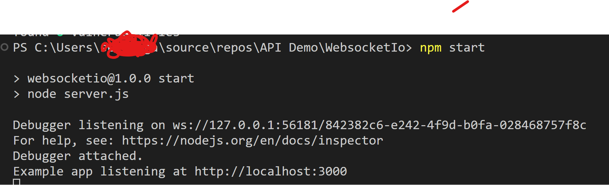

# Introduction
This example is to demonstrate Websocket functionality. This tutorial utilizes core Javascript Websocket package to host websocket server on node express through server.js. This sample also contains simple chat application which consumes websocket service and enable two way communication between server to client and vice versa.

# How to run this sample

 1. Clone the sample to local machine 
  
  ```console
    git clone https://github.com/sethanga/WebsocketIo.git
  ```

 2. Go to cloned folder and open the folder in vscode
    
 3. Start the websocket server
    Make sure you are in main project directory which is same as package.json

    
 ```Console
      npm install   

      npm start   
 ```

websocket server will now be started and will listening in port 3000

 

4. Start the Client Application to use chat applciation which consume websocket apis
    
     ```
     http://localhost:3000/chat
     ```

5. Start the server and client in Debug mode
Samples comes with .vscode folder which has node launch configuration which enables you start the debugging mode from vscode. 

    
